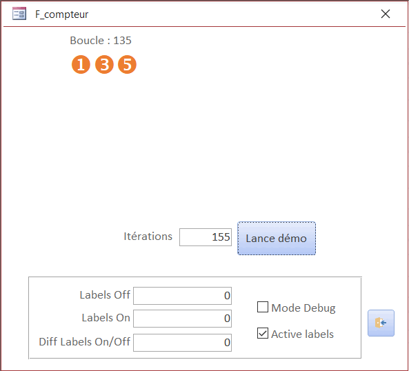

# MsAccess-Compteur
Petit compteur de décompte pour l'exécutions d'un code

# Formulaire démo


## Utilisation :
### Dans le Module/Classe
- Déclarer une variable de classe :
```vb
Private cCompte As C_UtCompteur
```
- Créer une procédure pour récupérer/détruire celle-ci à partir du formulaire :
```vb
Public Function GetInstanceclsLabels() As C_UtCompteur
    If (cCompte Is Nothing) Then Set cCompte = New C_UtCompteur
    Set GetInstanceclsLabels = cCompte
End Function

Public Sub ResetInstanceclsLabels()
    Set cCompte = Nothing
End Sub
```
- Dans le code initialise le compteur :
```vb
bRep = cCompte.SetCompteurs(E_LblRang.Rang1, lNbBoucle) '// lNbBoucle  : Record count ou autre.
```
- - Pendant l'exécution du code actualiser les labels :
```vb
cCompte.UpdateLabels Rang1, "Boucle : " & CStr(lCompte)
```
### Dans le formulaire
- Déclarer une variable de classe : Private cCpt As C_UtCompteur
- Récupérer l'instance utiliser dans la module/classe :
Set cCpt = MD_Demo.GetInstanceclsLabels()
- Initialiser les labels (rang1 et rang2 si vous les utiliser dans votre code) , et le label du Texte si vous voulez :
```vb
With cCpt

    bRep = .SetLabels(E_LblRang.Rang1, Me.lblU1, Me.lblD1, Me.lblC1)        '// Rang 1

    bRep = .SetLabels(E_LblRang.Rang2, Me.lblU2, Me.lblD2, Me.lblC2)        '// Rang 2

    .SetLabelTexte Me.lblCompteInfo

End With
```
- Lancer le code du module/classe
- A la fin vous pouvez masquer les labels avec :
```vb
cCpt.MasqueLabels Rang1
cCpt.MasqueLabels Rang2
```

Les Propriétés / Sub XDebug... permet de voir les différences de temps avec ou sans les labels.

Les erreurs sont gérées dans la classe `C_UtCompteur`, mais aucun message n'est affiché, voir les tag `'TODO ERR` pour insérer vos éventuels messages.

## Résumé

|   Créer le|   2022/08/20|
| - | - |
|   Auteur| [@meuslau](https://github.com/meuslaur)|
|   Catégorie|   MsAccess|
|   Type|   Utilitaire|
|   Langage|   VBA|

### Code exporté avec l'outil de : [@joyfullservice](https://github.com/joyfullservice) - [msaccess-vcs-integration](https://github.com/joyfullservice/msaccess-vcs-integration)

- Créez une base vide et utilisez `msaccess-vcs-integration` pour réimporter le code.
